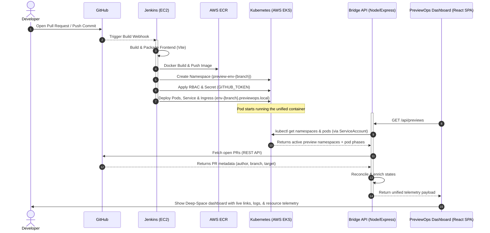

# 🚀 PreviewOps Control Center (Internal Developer Portal)
[](https://kubernetes.io)
[](https://aws.amazon.com/eks/)
[](https://www.terraform.io)
[](https://www.jenkins.io)
[](https://www.docker.com)
[](https://react.dev)
[](https://expressjs.com)
An enterprise-grade **Internal Developer Portal (IDP)** designed to orchestrate, track, and manage dynamic, ephemeral preview environments on-demand for Git pull requests. 
The system bridges Git branches, CI/CD orchestration, and Kubernetes namespaces, offering developers a central, zero-configuration dashboard to inspect running instances, check build telemetry, verify checks (lint/test/build), and manage environments.
---
## 🗺️ System Architecture
The following diagram illustrates how developer actions trigger infrastructure changes and how the **Bridge API** reconciles Kubernetes cluster states with GitHub PR data to deliver a unified console experience.

---
## 🌟 Key Features
*   **Dynamic Ephemeral Preview Environments:** Automatically provisions isolated namespaces (`preview-env-{branch}`) in the cluster for active branches/PRs.
*   **Deep-Space Sci-Fi Telemetry Console:** A premium terminal-themed dashboard built with **IBM Plex Mono**, custom glassmorphism panels, CSS scanlines, real-time sync timers, and glow animations.
*   **Same-Origin Micro-Service Bridge API:** Combines React frontend static assets and Express API endpoints into a single, low-memory Alpine-Docker package, running on port `3000`.
*   **Infrastructure-as-Code (IaC):** Standardized Terraform modules to boot secure, pre-configured Jenkins CI/CD instances on AWS EC2 (`m7i-flex.large`) with Docker and JDK 21 auto-bootstrapped.
*   **K8s-Native Discovery (RBAC Constrained):** Minimizes cluster attack surface by granting the Bridge API a dedicated, namespace-scoped `ServiceAccount` and `ClusterRole` binding to read namespaces and pods without root privileges.
*   **Dynamic Nginx Ingress Routing:** Generates virtual host routing for both frontends (`env-{branch}.previewops.local`) and API backends (`api-env-{branch}.previewops.local`) dynamically.
*   **Offline Resilience:** Implements fail-soft error handling—the Bridge API serves local status and cluster data gracefully even if GitHub API rates are throttled or kubectl is disconnected.
---
## 📁 Repository Structure
```filepath
├── .dockerignore
├── .gitignore
├── Dockerfile                   # Multi-stage Alpine container (Builds React -> packages Express)
├── Jenkinsfile                  # Dynamic CI/CD pipeline targeting ECR + AWS EKS
├── index.js                     # Root Express application serving SPA & Bridge API
├── package.json                 # Node.js dependencies (express, cors, dotenv)
├── bridge-api/
│   ├── .env                     # Local secrets configuration
│   ├── github-client.js         # Authenticated GitHub REST Client for PR extraction
│   └── k8s-client.js            # kubectl wrapper capturing Pod phase telemetry
├── frontend/
│   ├── index.html
│   ├── vite.config.js           # Vite config using path aliases
│   ├── tailwind.config.js       # Core typography (DM Sans / JetBrains Mono)
│   ├── src/
│   │   ├── main.jsx
│   │   ├── App.jsx
│   │   ├── components/
│   │   │   ├── DashboardView.jsx # Terminal-themed dashboard with layered glass & glow controls
│   │   │   ├── DeploymentCard.jsx
│   │   │   ├── MetricsHeader.jsx
│   │   │   └── PreviewsTable.jsx
│   │   └── hooks/
│   │       ├── useDeployments.js # State manager mapping environment cards
│   │       └── usePreviews.js    # Localhost-trap-proof API fetcher with auto-polling
│   └── package.json             # Frontend deps (lucide-react, react-dom, tailwindcss)
├── k8s/
│   ├── deployment.yaml          # K8s deployment using AWS ECR image tags
│   ├── ingress.yaml             # Nginx Ingress configuring CORS & dynamic host rules
│   ├── rbac.yaml                # Least-privilege ClusterRole & ServiceAccount bindings
│   └── service.yaml             # ClusterIP service forwarding port 80 -> 3000
└── terraform/
    ├── main.tf                  # Infrastructure configuration (AWS EC2, Jenkins dependencies, Security Group)
    └── .terraform.lock.hcl
```
---
## 🔧 Component Breakdown & System Design
### 1. Infrastructure-as-Code (`/terraform`)
Designed to automate CI/CD provisioning on AWS. [main.tf](file:///Users/shivenshukla/Desktop/Development%20Projects/Internal%20Developer%20Portal/terraform/main.tf) sets up:
*   **Ubuntu Jammy AMI lookup** directly via canonical owner IDs.
*   **Bulletproof User Data Script:** Waits for background Ubuntu updates to unlock `dpkg`, installs **JDK 21**, **AWS CLI**, **kubectl**, **Docker**, and **Jenkins**. It automates Jenkins permission bindings, enabling root-less docker builds inside the pipeline.
*   **AWS Security Groups:** Restricts incoming SSH (port `22`) to the administrator's IP address, while exposing port `8080` (Jenkins) and port `80` (HTTP) safely.
*   **EKS Node Integrations:** Configures security group rules directly on existing EKS target groups to route traffic seamlessly on port `80`.
### 2. CI/CD Orchestration (`Jenkinsfile`)
The declarative deployment pipeline ([Jenkinsfile](file:///Users/shivenshukla/Desktop/Development%20Projects/Internal%20Developer%20Portal/Jenkinsfile)) runs inside Jenkins to automate the build-test-deploy lifecycle:
*   **Branch Sanitization:** Converts raw Git branch names containing spaces/slashes into lowercase, URL-safe identifiers (e.g., `feature/login-v2` becomes `feature-login-v2`).
*   **Multistage Pipeline:**
    1.  *Build Frontend:* Pulls Node dependencies, runs `npm run build` using Vite, generating optimized assets in `frontend/dist`.
    2.  *Docker Build & Push:* Uses an authenticated IAM role to login to AWS ECR, tags the image with the build number, and pushes it.
    3.  *EKS Deploy:* Updates Kubeconfig, dynamically templates `k8s/deployment.yaml`, `k8s/rbac.yaml`, and `k8s/ingress.yaml` with the sanitised environment variables via inline `sed` injections, builds K8s Secrets dynamically with credential keys, and applies the manifests.
### 3. Unified Runtime Container (`Dockerfile`)
A 3-stage container built for production efficiency:
*   **Stage 1 (Frontend):** Builds the Vite React application.
*   **Stage 2 (Backend):** Installs Express dependencies and bundles the static frontend output.
*   **Stage 3 (Dist):** Uses lightweight Alpine Linux, mounts only required production dependencies, fetches and installs `kubectl` inside `/usr/local/bin` to query the cluster state, and exposes port `3000`.
### 4. Bridge API Service (`/bridge-api`)
Built using Express, the Bridge API maps and indexes active environments:
*   **`k8s-client.js`:** Runs a non-blocking `execFile` command wrapping `kubectl` to fetch namespace metadata. Pod status maps into:
    *   `Live`: All pods are `Running` and passing health check probes.
    *   `Provisioning`: Containers are creating or pulling images.
    *   `Tearing Down...`: Pods contain a `deletionTimestamp`.
    *   `Destroyed`: Pods have failed or are empty.
*   **`github-client.js`:** Fetches active Pull Requests from the repository. Builds two lookup maps: `byHead` (indexed by source branch) and `byBase` (indexed by target branch).
*   **Data Enrichment (`index.js`):** Parallely queries both sources using `Promise.all()`. For target dashboards (like `master`), it maps incoming PRs to display detailed cards. If no PR is open, it gracefully falls back to showing branch-level environments.
### 5. Developer Portal UI (`/frontend`)
The user interface is built to provide maximum legibility under high-stress ops situations:
*   **Self-Resolving API Client (`usePreviews.js`):** Solves the **"Localhost Trap"** on EKS. It parses the browser's current `window.location.hostname` to automatically derive the backend host (routing `env-123.previewops.local` frontend request to same-origin `/api` routes).
*   **Micro-interactions & Glow Effects:** Utilizes CSS keyframe triggers to display pulsing active states, glowing progress cards, animated terminal scanlines, and typewriter cursor indicators.
*   **Client-side quick filters:** Real-time search of preview environments by branch name, PR ID, or author, along with status filter pills.
---
## ⚡ Quick Start & Setup
### Local Development (Simulated Mode)
You can develop and run the portal locally without an AWS or Kubernetes cluster. The API will notice `kubectl` is missing and gracefully fallback to simulated, mock states.
1.  **Clone the Repository:**
    ```bash
    git clone https://github.com/shivenrshukla/previewops.git
    cd previewops
    ```
2.  **Configure Environment Secrets:**
    Create a file named `.env` inside `bridge-api/`:
    ```ini
    GITHUB_TOKEN=your_personal_github_access_token
    GITHUB_REPO=shivenrshukla/previewops
    PREVIEW_URL_TEMPLATE=http://localhost:3000
    ```
3.  **Install & Run concurrently:**
    Run the following command at the root of the project to boot the Vite Dev Server and the Express API server concurrently:
    ```bash
    npm install
    npm run dev
    ```
    Open your browser and navigate to `http://localhost:5173`.
---
## 🔒 Security Practices & Controls
*   **Scoped Kubernetes RBAC:** The app is configured with a dedicated `ServiceAccount`. It is bound via `ClusterRoleBinding` strictly to `get`, `list`, and `watch` permissions for `namespaces` and `pods`. It has no permissions to write, delete, edit configurations, or inspect secrets.
*   **Protected Secrets:** No secrets or credentials are hardcoded into Docker images or repository code. The Jenkins pipeline reads credential stores securely and pushes them into K8s secrets (`bridge-api-secrets`) at deploy-time, which are loaded as environment variables inside the pod.
*   **Dynamic CORS Isolation:** The Nginx Ingress annotation `nginx.ingress.kubernetes.io/enable-cors` guarantees that CORS controls are mapped only to authenticated hosts, blocking unauthorized domain lookups.
---
## 💡 Recruiters Fast-Track: Key Engineering Patterns to Inspect
If you are an SDE recruiter or manager evaluating this repository, take a look at these unique engineering patterns showing production-ready depth:
1.  **The "Same-Origin API Resolve" Pattern:** Look at [usePreviews.js](file:///Users/shivenshukla/Desktop/Development%20Projects/Internal%20Developer%20Portal/frontend/src/hooks/usePreviews.js#L26-L43). Instead of hardcoding API hosts (which breaks on ephemeral subdomains), the React app dynamically computes the API base based on `window.location.hostname`, keeping local proxying and production routing completely transparent.
2.  **Resilient Fail-Soft CLI Executions:** Check [k8s-client.js](file:///Users/shivenshukla/Desktop/Development%20Projects/Internal%20Developer%20Portal/bridge-api/k8s-client.js#L50-L63). Instead of crashing the backend if Kubernetes is unreachable or missing during local dev, the app catches `ENOENT` and falls back into a warning mode, preserving system uptime.
3.  **Parallel IO Resolution:** Inspect [index.js](file:///Users/shivenshukla/Desktop/Development%20Projects/Internal%20Developer%20Portal/index.js#L69-L72). Resolving Kubernetes namespace lookups and GitHub API queries concurrently via `Promise.all()` cuts the API request roundtrip latency in half.
4.  **Sanitized Sed templating:** Check [Jenkinsfile](file:///Users/shivenshukla/Desktop/Development%20Projects/Internal%20Developer%20Portal/Jenkinsfile#L44-L67). It showcases safe shell manipulation using environment flags to create declarative YAML templates on-the-fly, preventing hard-coded properties from leaking into the repository.